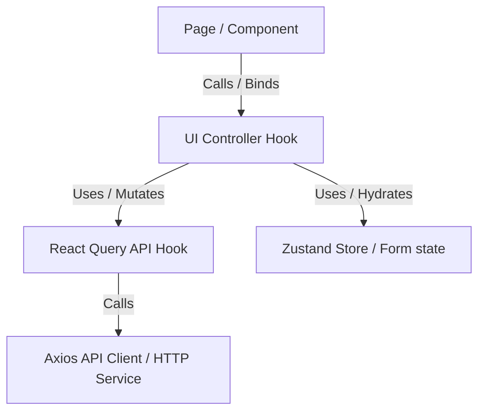

# AI Coding Agent Guidelines (`AGENTS.md`)

Welcome, coding agent! This document details the conventions, file organization, architecture, and constraints of the `equits-front` Next.js codebase. Please follow these guidelines strictly to ensure code quality, readability, and consistency.

---

## 1. Core Architecture Pattern

We adhere to a strict **Separation of Concerns** using the **UI Controller Pattern**.



### 🚨 Crucial Rules:
1. **No direct API calls or mutations in UI Components.**
   Always delegate state management, event handling, translation fetching, and API calls to a UI Controller (under `hooks/ui/`).
2. **Component File (Markup Only):** Keep page and component files as thin as possible. They should only layout the layout structure, styles, classes, and bind fields to controller variables.
3. **No raw React state for forms:** Use `react-hook-form` and delegate it to the UI controller hook.

---

## 2. Directory Layout & Where to Write Code

When adding a feature, follow this directory mapping:

| Module / Logic | Directory | Description / Example |
| :--- | :--- | :--- |
| **Pages & Routes** | `app/` | Next.js App Router folders (`explore`, `projects`, `(auth)`). |
| **Layout & Views** | `components/` | Custom markup UI components. |
| **API Queries/Mutations**| `hooks/api/` | Custom hooks wrapping TanStack React Query (`useAuth.ts`, `useProject.ts`). |
| **UI Logic Controllers**| `hooks/ui/` | Hooks managing page states, forms, and handlers (`useLoginController.ts`). |
| **HTTP Clients** | `services/` | Axios clients calling backend routes (`project.service.ts`). |
| **Zod Schemas** | `validations/` | Form validations with dynamic translation parameters (`project.validation.ts`). |
| **Local States** | `stores/` | Zustand state stores (`useAuthStore.ts`). |
| **Constants/Keys** | `constants/` | Caching query keys (`queryKeys.ts`). |

---

## 3. Step-by-Step Feature Implementation Guide

When creating a new feature (e.g., "Add Project Rating"):

1. **Define Types:** Add models in `types/api.ts` or `types/project.ts`.
2. **Define Query Keys:** Add the caching keys in [queryKeys.ts](file:///d:/Workspace/equits/equits-front/constants/queryKeys.ts).
3. **Add HTTP Endpoint:** Add function in the corresponding service (e.g. `services/project.service.ts`).
4. **Create API Hook:** Add a query/mutation hook under `hooks/api/` (e.g. `hooks/api/useProject.ts` -> `useSubmitRating()`).
5. **Create Zod Validation Schema:** Create the schema function accepting translations in `validations/`.
6. **Create UI Controller:** Write the logic hook under `hooks/ui/` (e.g. `useRatingFormController.ts`).
7. **Assemble Component:** Bind the component in `components/` or `app/` to the controller hook.

---

## 4. Internationalization (i18n)

We support **English** and **Arabic** translation bundles.

* **Translation Keys:** Main translations reside in [en.json](file:///d:/Workspace/equits/equits-front/messages/en.json) and [ar.json](file:///d:/Workspace/equits/equits-front/messages/ar.json).
* **Usage:** Use `useTranslations` from `next-intl` in your UI controller. Pass the translation handler `t` down to validation schemas:
  ```typescript
  // In UI Controller:
  const validationT = useTranslations("Auth.Validation");
  const schema = getLoginSchema(validationT);
  ```
* **Safe Translation:** Use the custom hook `useSafeTranslate` (from `hooks/ui/useSafeTranslate.ts`) to avoid UI crashes when translation keys or error strings are missing.

---

## 5. Coding Standards & Conventions

* **TypeScript Strictness:** Never use `any` unless absolutely necessary. Provide interfaces and schemas for all API requests and responses.
* **Component Imports:** Use path aliases: `@/components/...`, `@/hooks/...`, `@/stores/...`, etc.
* **Theme Styling:** Use HeroUI design system components and Tailwind v4 theme variables (e.g., `text-primary`, `bg-dark`). Avoid raw hex codes in components.
* **Animation:** Wrap entering components in `<StaggerContainer>` and `<StaggerItem>` or `<FadeIn>` from `components/ui/animations` to guarantee smooth, premium page loading animations.
